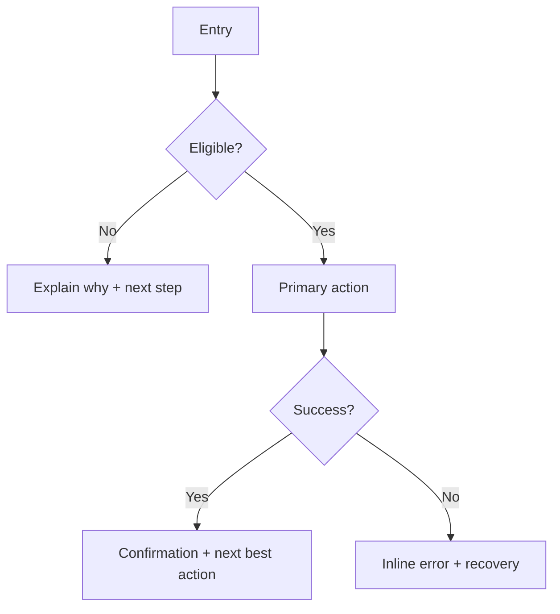

# UI/UX

## Quick Intake

先用最少問題補齊脈絡（缺就問，夠就進入產出）：

- 目標使用者/情境：誰，在什麼場合，用什麼裝置
- 主要任務：使用者要完成什麼（1–3 個）
- 成功指標：完成率、時間、錯誤率、轉換、留存等
- 限制：技術/時程/法規/品牌/既有 design system
- 平台：iOS / Android / 跨平台一致性需求

## Workflow Decision Tree

1. **要把需求落成設計？** → 用「需求→體驗方案」
2. **要檢查既有介面？** → 用「介面審查」
3. **要交付工程可實作規格？** → 用「設計規格」
4. **要研究驗證？** → 用「研究與測試」
5. **要寫文案與狀態文？** → 用「UX Writing」

## 需求→體驗方案

輸出順序（需要什麼就做到那一步）：

1. 問題定義（JTBD / 使用者目標 / 痛點）
2. 使用情境與假設（可驗證）
3. User flow（主路徑 + 失敗/中斷路徑）
4. IA / 導覽策略（若是多頁/多模組）
5. Wireframe（文字描述即可）
6. 風險與取捨（跨平台差異、可用性、技術限制）

**User flow 模板（Mermaid）**

**Wireframe（文字）模板**

- Screen name：
- Primary user goal：
- Layout（由上到下）：
  - App bar：標題、返回、次要動作
  - Content：關鍵資訊區塊（優先順序）
  - Primary CTA：文案、狀態（enabled/disabled/loading）
  - Secondary actions：位置與層級
- Edge cases：空狀態、錯誤、離線、權限拒絕
- Accessibility：螢幕閱讀、對比、觸控區、動態字級

## 介面審查（Heuristic Review）

做法：先列出「任務」再逐畫面走一遍，最後用 severity 分級（P0–P3）與修正建議。

**UX 審查表（可直接貼回 issue）**

- 任務：
- 場景/裝置：
- 主要問題（P0/P1/P2/P3）：
  - 發現：
  - 影響：完成不了/容易錯/慢/不安心
  - 證據：哪個畫面/哪個步驟
  - 建議：具體改法（含文案/互動/視覺層級）
- Heuristics 覆蓋：
  - 系統狀態可見性（loading、progress、結果）
  - 符合真實世界（用語、單位、心智模型）
  - 使用者掌控（可取消/可返回/可復原）
  - 一致性（跨平台/元件/術語）
  - 防錯（預防 > 錯誤訊息）
  - 辨識勝過記憶（提示、預設、最近使用）
  - 彈性與效率（捷徑、批次、預填）
  - 美觀與極簡（資訊密度、層級）
  - 錯誤處理（可理解、可修復）
  - 幫助與文件（必要時）

## 設計規格（iOS/Android/跨平台）

目標：讓工程不猜，包含狀態、邊界、無障礙。

**Spec 模板**

- Feature：
- Platforms：iOS / Android / shared
- Entry points：
- Screens：
  - Screen A
    - Components：
    - States：default / loading / empty / error
    - Interactions：tap / long-press / swipe / back
    - Validation rules：
    - Analytics events（若需要）：
- Component contract（若需設計系統）：
  - Props：
  - Variants：
  - Tokens：spacing / typography / color
- Accessibility：
  - 最小觸控區（44pt/48dp 思路）
  - Dynamic type / font scale
  - Contrast
  - Focus order / TalkBack/VoiceOver

## 研究與測試（Usability / 訪談）

**測試計畫模板**

- 研究問題：
- 假設：
- 對象：招募條件、樣本數（5–8 起步）
- 方法：面對面/遠端、未引導/半引導
- 任務腳本：
  1. 任務 1（成功定義）
  2. 任務 2（成功定義）
- 指標：完成率、時間、嚴重錯誤數、SUS/單題量表
- 記錄：觀察點、引用語句、截圖/錄影
- 產出：洞察 → 問題清單（severity）→ 建議 → 後續驗證

## UX Writing（文案）

原則：短、具體、可行動；先說原因再給下一步；避免責怪使用者。

**Microcopy 模板**

- CTA：動詞 + 受詞（例："新增食材"、"儲存變更"）
- Empty state：
  - 標題（發生什麼）
  - 說明（為什麼重要/接下來）
  - 主 CTA（下一步）
- Error message：
  - 發生什麼（人話）
  - 可能原因（必要時）
  - 怎麼辦（重試/檢查輸入/聯絡支援）

## Integration（A：product-planning → ux-design）

預設把 `product-planning` 的 PRD 當成唯一需求來源，先做「對齊/補洞」再開始畫 flow。

**讀 PRD 時先抽出這些欄位**

- 使用者與情境（角色/權限/Top use cases）
- 成功指標（North Star / supporting / guardrails）
- `FR-#` + `AC`（每條都要能對應到畫面/狀態/互動）
- Edge cases（錯誤、離線、權限拒絕、復原）
- 埋點需求（若適用）

**Traceability（必做）**

- 任何 flow 節點、wireframe、spec 條目，都要標註它支援的 `FR-#`（缺對應就視為範圍外或需求不明）。

**若 PRD 不足，先回問 product-planning**

- 哪些 `FR-#` 沒有 AC
- 成功指標缺定義/量測窗
- 角色/權限不清
- Edge cases 未列或與 AC 矛盾

## Output Bundle（建議）

交付時把以下內容一起產出（可按情境刪減），並保持 `FR-#` 對應：

- User flow（Mermaid，標註 `FR-#`）
- Wireframe（文字，標註 `FR-#`）
- UX 審查表（若是評審）
- Spec（狀態/互動/edge cases/無障礙，逐條對應 `FR-#`）
- 測試計畫（研究問題 + 任務 + 指標，驗證 PRD 假設/指標）
